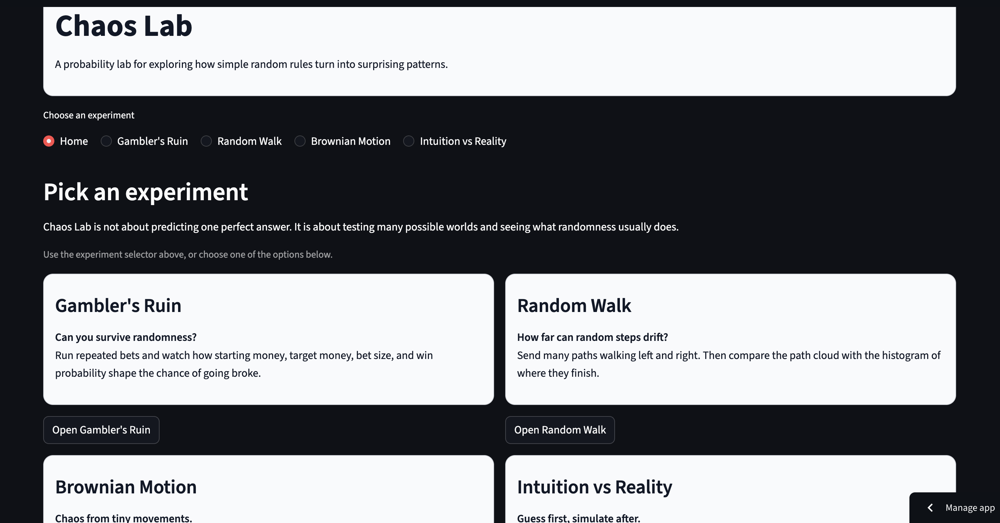
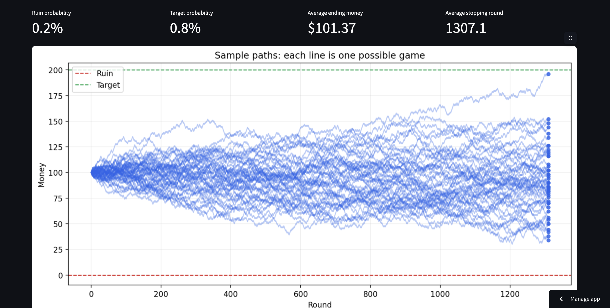
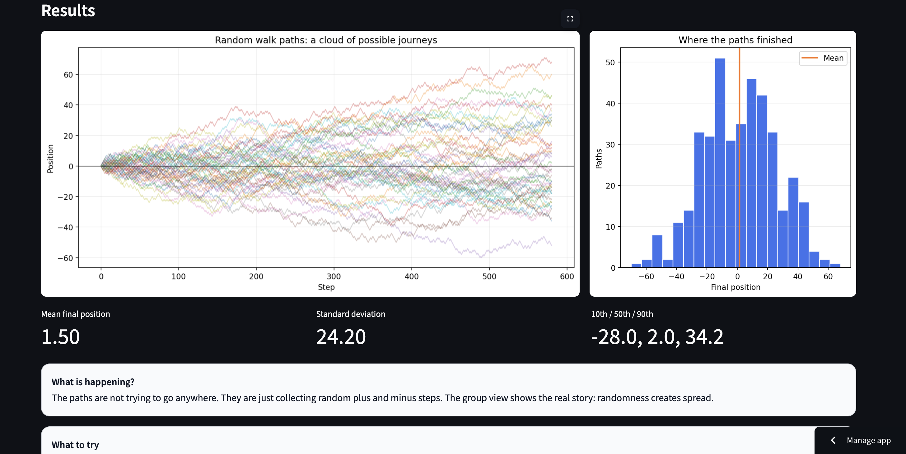
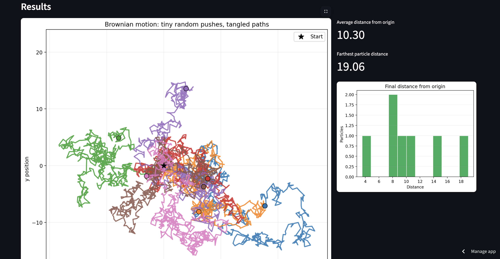
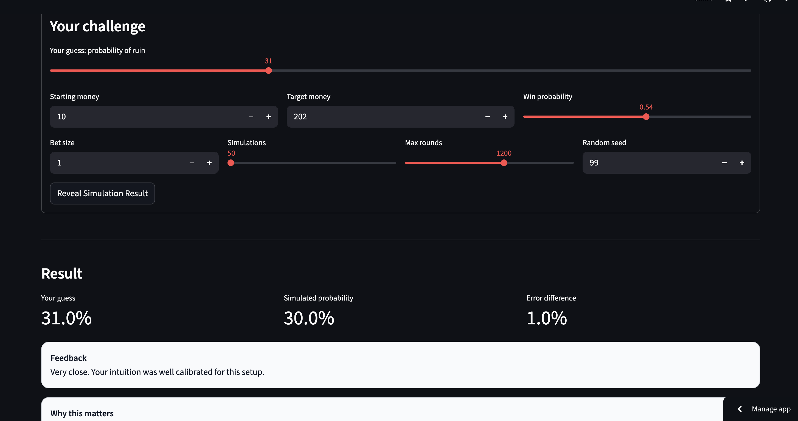

# Chaos Lab

Live app: https://chaos-lab.streamlit.app

Chaos Lab is an interactive simulation playground for exploring randomness, probability, and stochastic processes through hands-on experiments.

Instead of presenting fixed results, the app lets you run simulations, adjust assumptions, and observe how outcomes change. The goal is to build intuition about how simple random rules can produce complex and often unintuitive behavior.

---

## Overview

Chaos Lab is structured as a set of small experiments:

* **Gambler’s Ruin** — survival vs. ruin under repeated bets
* **Random Walk** — how variance grows over time
* **Brownian Motion** — chaotic motion from small random steps
* **Intuition vs Reality** — test your probability intuition

Each experiment follows the same loop:

1. Choose parameters
2. Run simulation
3. Observe outputs
4. Adjust and compare

---

## Features

* Clean, experiment-based UI (no global control clutter)
* Interactive parameter controls inside each experiment
* Multiple simulation types with consistent structure
* Path visualizations and distribution plots
* Interpretation-focused explanations (“what to notice”)
* Input limits for smooth performance on Streamlit Cloud
* Modular Python structure separating UI and simulation logic

---

## Screenshots

### Home


### Gambler’s Ruin


### Random Walk


### Brownian Motion


### Intuition vs Reality


---

## Experiments

### Gambler’s Ruin

A player repeatedly makes fixed-size bets. Each round results in a gain or loss.

The simulation stops when:

* money reaches zero (ruin)
* target is reached
* maximum rounds are hit

This experiment shows how:

* small probability edges matter
* bet size affects risk
* long-term survival is not guaranteed even in “fair” games

---

### Random Walk

A value starts at zero and moves step-by-step with random variation.

Optional drift shifts the expected direction, but randomness still dominates.

Key idea:

> Variance increases over time, even when expected change is zero.

---

### Brownian Motion

Particles move in 2D space with small random displacements each step.

There is no direction or control, but paths appear complex and structured.

This connects to:

* diffusion
* stochastic processes
* continuous random motion

---

### Intuition vs Reality

You estimate the probability of ruin before running a simulation.

The app compares:

* your estimate
* simulated result

This highlights how intuition often misjudges probabilistic systems.

---

## What I Learned

* Structuring a project into UI and simulation layers
* Using NumPy for repeatable stochastic simulations
* Visualizing distributions and paths with Matplotlib
* Estimating probabilities through repeated trials
* Designing interactive systems instead of static outputs
* Writing explanations that guide exploration, not just describe results

---

## Running Locally

```bash
cd chaos-lab
python -m venv .venv
source .venv/bin/activate   # macOS/Linux
pip install -r requirements.txt
streamlit run app.py
```

---

## Deployment

Deployed via Streamlit Community Cloud from GitHub.

Set main file to:

```text
app.py
```

---

## Project Structure

```text
chaos-lab/
├── app.py
├── requirements.txt
├── README.md
├── .gitignore
├── screenshots/
└── src/
    ├── gambler.py
    ├── random_walk.py
    ├── brownian.py
    └── metrics.py
```

---

## Limitations

* Simulations approximate probability; results vary by run
* Simplified models (not full physical or financial systems)
* Performance constraints limit simulation size
* Brownian motion is a discrete approximation

---

## Future Improvements

* Brownian motion animation
* Analytical gambler’s ruin formulas
* 2D grid-based random walk
* Exportable simulation results
* Expanded intuition-testing scenarios

---

## Disclaimer

This project is for educational purposes only.
